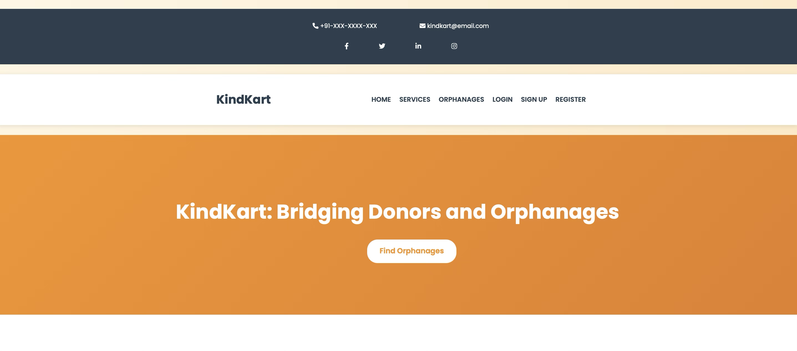
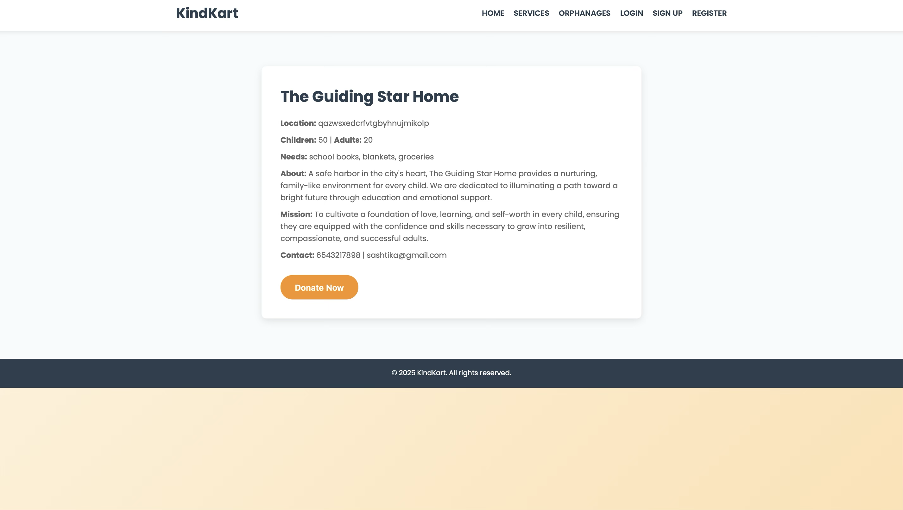

# KindKart – Resource Sharing Platform

KindKart is a web-based platform designed to connect donors with under-supported communities such as orphanages. It allows users to view needs, donate essential items, and ensure resources reach the right people efficiently.

---

## Features

- User-friendly interface for donors
- View orphanage details and requirements
- Browse registered orphanages
- Donate essential items easily
- Donation confirmation system
- Structured data handling for smooth interaction

---

## Tech Stack

- **Frontend:** HTML, CSS, JavaScript  
- **Backend:** Python / PHP  
- **Database:** MySQL  
- **Architecture:** REST-based interaction  

---

## Objective

To build a centralized platform that simplifies the donation process and ensures that help reaches under-supported communities efficiently and transparently.

---

##  Screenshots

### Home Page

### Orphanage Details

### Registered Orphanages

### Donation Interface

  
  

---

## Future Enhancements

- Real-time notifications
- Advanced search and filtering
- Mobile responsiveness improvements
- Payment gateway integration

---

